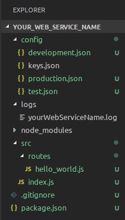

# Creating a web service with `@tne/express-app`

## raw javascript
1. create a folder to hold the entire code and navigate into it with console.
```
$ mkdir your_web_service_name && cd $_
```

2. init npm package
```
$ npm init -y
```

3. install [@tne/express-app](https://github.com/virgenherrera/tne-express-app#readme)
```
npm install --save @tne/express-app
```

4. Create base folder structure and config files
```
$ mkdir config src src/routes/
$ touch .gitignore config/development.json config/production.json config/test.json config/keys.json src/index.js src/routes/hello_world.js
```

5. init config files
```
echo {} | tee config/development.json config/keys.json config/production.json config/test.json
```

6. init `hello_world.js` route
copy and paste the following code to tour `src/routes/hello_world.js` file.
```
const { express } = require('@tne/express-app');
const router = express.Router();

module.exports.default = router
    .get('/', (req, res) => res.json({ msg: 'Hello from @tne/express-app library' }));

```

7. init the `index.js` file.
copy and paste the following code to tour `src/index.js` file.
```
const { ExpressAppInterface } = require('@tne/express-app');

ExpressAppInterface.construct({
    appPath: __dirname,
    appName: 'Your Web Service Name',
    port: 3000,
    routesFolder: './routes',
});
```

8. update `package.json` file
in this moment we are almost ready to begin but `package.json` file is not ready, so we must to update it in order to prepare to launch the web service.
> By pointing the `src/` folder on the __main__ property and adding a **start script** that leads to `src/` folder we are ready.
```
"main": "./src/",
  "scripts": {
    "test": "echo \"Error: no test specified\" && exit 1",
    "start": "node ./src/"
  },
```

9. init `.gitignore` file.
last but not least, you must to ignore following files:
```
# Logs
logs
*.log

# Dependency directories
node_modules/

# Environment sensitive data
# keys files
keys.json
```

10. final step: first run
now we are ready to launch by first time our service by typing in terminal:
```
npm start
```

## Summarizing
### Folder structure
> The above steps will produce a file structure like this:



